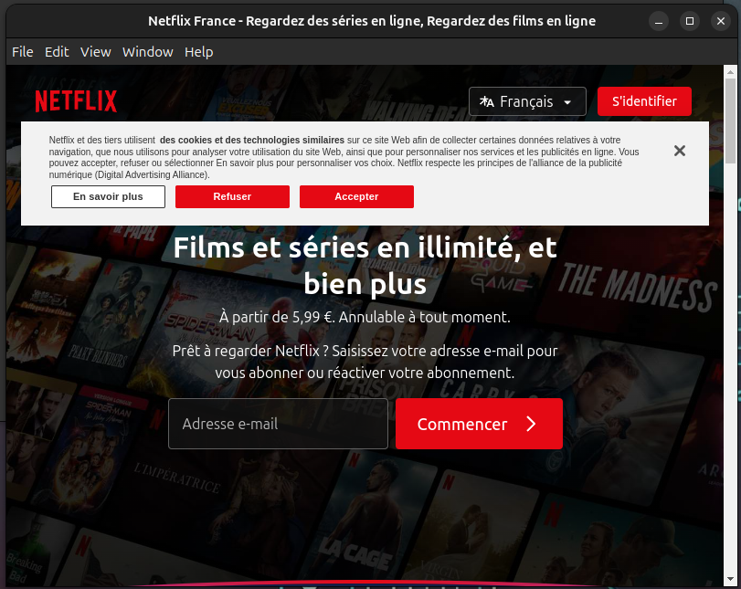

# Stream Linux Suite

- it's free application for desktop Linux
---
## Dependence

- nodeJS: v22.11.0
- npm: 11.0.0
- For installing nodeJS : [Click Here](https://nodejs.org/en/download)

## Dowload installer

[📥 Télécharger Stream Suite Linux (.deb)](installer_linux/stream-suite-linux_1.0.0_amd64.deb)

## Or Initialisation

**For linux user** 
- Netflix, Amazon Prime, Disney+
- version 1.0.0


```bash 
git clone https://github.com/stephaneThiebaut-collab/stream-linux-suite.git && cd stream-linux-suite
```

```bash 
npm install 
```

## Making app 

```bash 
npm run make 
```

- Make folder out/

```bash 
cd out/make/deb/x64
```

- for debian / Unbuntu

```bash 
sudo chmod +x stream-suite-linux_1.0.0_amd64.deb
```
## Install

```bash
sudo dpkg -i ./stream-suite-linux_1.0.0_amd64.deb

```
## run
on your terminal 
```bash 
suite-linux-streaming
```
or your search bar
```bash 
stream
```
---


## Accueil

## Netflix

## Amazon

## Disney


## Lancher desktop

- Go to img/icon and dowload icon.webp
- Open a terminal in your desktop 


- Create your .desktop file

for exemple: 
```bash
touch streaming.desktop && sudo nano streaming.desktop
```


```bash
[Desktop Entry]
Type=Application
Name=Linux Streaming
Exec=stream-suite-linux
Icon=your/path/of/icon.webp
Terminal=false
Categories=Utility
```
to know the path of your download image
go to yout download

```bash 
realpath yourIcon.webp
```

And put the result of realpath a the 'Icon=' for the .dekstop

for me it's 
```bash
/home/alkantarade/Téléchargements/icon.webp
```

after 
```bash
sudo chmod +x streaming.desktop
```
And


### Uninstall 

```bash 
sudo apt remove stream-suite-linux
```
